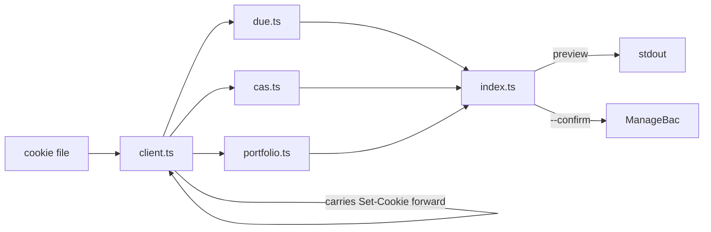

```
 ██████╗  █████╗  ██████╗ ██████╗  █████╗  ██████╗ ██╗  ██╗
 ██╔══██╗██╔══██╗██╔════╝██╔══██╗██╔══██╗██╔════╝██║ ██╔╝
 ██████╔╝███████║██║     ██████╔╝███████║██║     █████╔╝
 ██╔══██╗██╔══██║██║     ██╔═══╝ ██╔══██║██║     ██╔═██╗
 ██████╔╝██║  ██║╚██████╗██║     ██║  ██║╚██████╗██║  ██╗
 ╚═════╝ ╚═╝  ╚═╝ ╚═════╝╚═╝     ╚═╝  ╚═╝ ╚═════╝╚═╝  ╚═╝
```

<div align="center">

### `MANAGEBAC // FROM THE TERMINAL`

*your deadlines, your CAS hours and your learner portfolio, without the four clicks*


-374151?style=flat-square&labelColor=111111)


</div>

---

## 📚 What is this

ManageBac has a public API. It is administrator-only, and if you are a student you are not getting a key. bacpack takes the other route: your own session cookie, the same one your browser already holds, and reads the pages you can already see.

It does three things. It tells you what is due, it logs CAS experiences, and it adds entries to a Learner Portfolio. Reads are live, so there is no local copy to go stale. Writes print what they are about to send and then stop, because a school record is not a place to find out your flags were wrong.

The interesting parts are not the HTTP. ManageBac rotates your session cookie mid-conversation and answers 422 when you replay the old one, which reads like rate limiting and is not. It prints dates without a year. Teachers post the same deadline twice. bacpack is mostly the handling of those three facts.

```console
nick@bacpack:~$ bacpack due --days 14
[✓] 2 deadlines found. both are the same IA, posted twice by the same teacher.
[i] dedupe matches exact title and time only. anything fuzzier hides real work.
```

## 🎒 The commands

| | command | what it actually does |
|---|---|---|
| 01 | **`due`** | upcoming deadlines, `--days N` to cut it short. infers the missing year, keeps genuine duplicates |
| 02 | **`classes`** | your classes and their ids, mostly so you can see what `--class` will match |
| 03 | **`cas list`** | every CAS experience with hours, strands and reflection count |
| 04 | **`cas outcomes`** | the seven IB learning outcomes and their ids — per school, so read, never hardcoded |
| 05 | **`cas groups`** | school groups you can attach an experience to |
| 06 | **`cas add`** | creates an experience: strands, service type, approaches, supervisor, group, outcomes |
| 07 | **`cas edit`** | changes one. anything you don't pass keeps its current value |
| 08 | **`cas delete`** | removes one, after showing you its hours and reflection count |
| 09 | **`cas reflect`** | adds a reflection to an experience, found by name. body only — see below |
| 10 | **`class units`** | unit plans with their status and HL/SL badges |
| 11 | **`class files`** | the class file tree, folders first |
| 12 | **`class discussions`** | discussion threads with their ids |
| 13 | **`portfolio list`** | portfolio entries with their tags and the first lines of each body |
| 14 | **`portfolio tags`** | the works and the whole IB tag taxonomy, grouped. works change every September |
| 15 | **`portfolio add`** | adds an entry. `--tags concepts/culture` by name, no id lookup |
| 16 | **`portfolio edit`** | changes an entry. anything you don't pass keeps its current value |
| 17 | **`portfolio star`** | toggles the star |
| 18 | **`portfolio delete`** | removes an entry, after showing you which one |

Every read takes `--json`. Every write previews and exits; `--confirm` is what actually posts.

`cas edit` and `portfolio edit` read the record first and reuse whatever you leave out. Both edit forms overwrite every field they post, so `--service 9` on its own would otherwise wipe the approaches, supervisor and outcomes without mentioning it.

Two ManageBac quirks worth knowing. A CAS group can only be set when the experience is created: the edit form has no group field, so `cas edit` omits it rather than posting a blank that would unlink it. And `class_stream` has no command, because it renders no items in the page source for any class tested, so it is either drawn by JavaScript or unused.

`cas reflect` takes a body and nothing else. The create form carries no learning-outcome checkboxes, and an `evidence[url]` value posts cleanly and then appears nowhere. Both were tested live and silently dropped, so there are no flags for them — a flag that previews confidently and changes nothing is worse than a missing feature.

`--class` takes part of a class name, not an id: `--class greek`. Ids change each school year, and every class exposes the portfolio route, so a name is both safer and shorter than the number.

## 🚀 Run it

Needs [Bun](https://bun.sh). You supply two things: your school's subdomain, and your session cookie.

```bash
git clone https://github.com/nitrimandylis/bacpack.git
cd bacpack
bun install
bun run compile   # → ~/.bun/bin/bacpack, plus man bacpack
```

Then, once:

```bash
export MANAGEBAC_SCHOOL=yourschool          # yourschool.managebac.com
mkdir -p ~/.config/managebac
# paste the value of the _managebac_session cookie into this file:
$EDITOR ~/.config/managebac/cookie
chmod 600 ~/.config/managebac/cookie
```

To find the cookie: log in to ManageBac, open devtools, Application → Cookies → your ManageBac domain, copy the value of `_managebac_session`. It lasts about a year. When it dies you get a clean 401 telling you so, not a silent empty result.

```bash
bacpack due
bacpack portfolio add --class greek --body-file entry.html --tags culture
man bacpack        # full reference, offline
```

The second one prints what it would send and stops. Add `--confirm` when you mean it.

## 🤖 Driving it with an agent

[`bacpack-cli/SKILL.md`](bacpack-cli/SKILL.md) is the operating manual for coding agents. It covers the flags, but the useful half is what `--help` has no room for: which flag emails a real teacher, which field ManageBac accepts and then silently discards, which ids expire every September, and why a page that parses to nothing is breakage rather than a quiet week.

It's a plain directory, not a vendor one, so drop it wherever your agent keeps skills:

```bash
cp -R bacpack-cli ~/.claude/skills/     # or wherever yours looks
```

`bun run compile` does exactly that line. Change the destination to suit.

## 🔩 Under the hood



| layer | path | job |
|---|---|---|
| client | `src/client.ts` | one session. carries the rotated cookie forward, retries, tells 401 from 422, resolves a class by name |
| due | `src/due.ts` | year inference, dedupe, and the guard that shouts when the selectors rot instead of reporting nothing due |
| cas | `src/cas.ts` | experiences and the create form, including the advisor-email checkbox that ships pre-ticked |
| portfolio | `src/portfolio.ts` | reflections, the tag taxonomy, and the create form that has no title field |
| cli | `src/index.ts` | argument parsing and the preview that stands between you and a permanent record |

Three failure modes are handled by name, because all three have happened. `401` means the cookie died, so it says so and stops. `422` means the session rotated, so it retries with the new one. `200` with nothing parseable means ManageBac changed its markup, so it exits non-zero rather than telling you your week is clear.

**Stack:** Bun · TypeScript · `node:util` parseArgs · no runtime dependencies

## 🙏 Credit

The idea came from [rhijjawi/ManageBac-API](https://github.com/rhijjawi/ManageBac-API) by Ramzi, which worked out the part that is actually hard to guess: that a plain `_managebac_session` cookie is enough, and which page to point it at. Everything downstream of that follows.

No code was taken. It last saw a real commit in 2021 and its selectors (`upcoming-tasks`, `task-node`, `js-presentation`, `date-badge`) match nothing on the 2026 pages, so bacpack reads the markup as it stands today. Knowing the door was unlocked was the contribution, and it saved an afternoon of wondering whether it was.

---

<div align="center">

**[Nick Trimandylis](https://github.com/nitrimandylis)**

`READ LIVE. WRITE TWICE, THE SECOND TIME ON PURPOSE`

MIT licensed.

</div>
