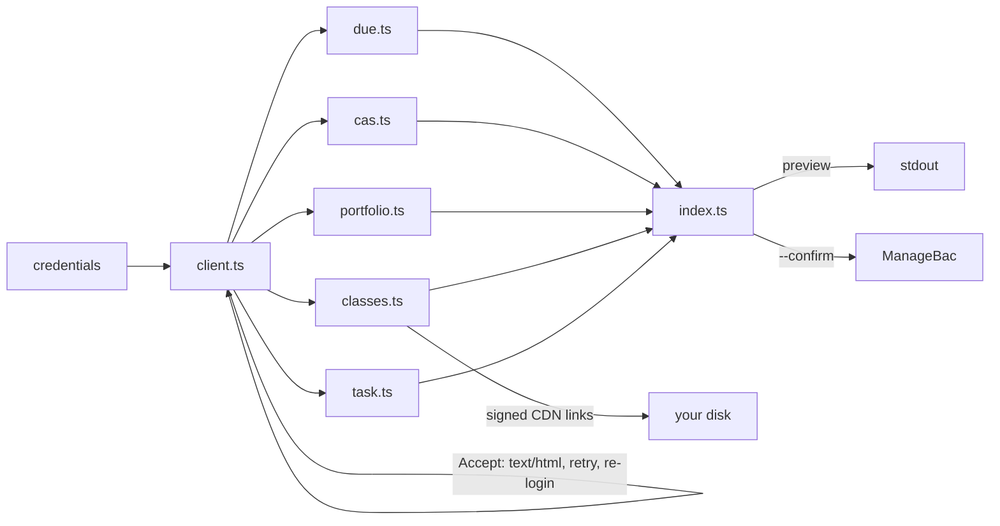

```
 ██████╗  █████╗  ██████╗ ██████╗  █████╗  ██████╗ ██╗  ██╗
 ██╔══██╗██╔══██╗██╔════╝██╔══██╗██╔══██╗██╔════╝██║ ██╔╝
 ██████╔╝███████║██║     ██████╔╝███████║██║     █████╔╝
 ██╔══██╗██╔══██║██║     ██╔═══╝ ██╔══██║██║     ██╔═██╗
 ██████╔╝██║  ██║╚██████╗██║     ██║  ██║╚██████╗██║  ██╗
 ╚═════╝ ╚═╝  ╚═╝ ╚═════╝╚═╝     ╚═╝  ╚═╝ ╚═════╝╚═╝  ╚═╝
```

<div align="center">

### `MANAGEBAC // FROM THE TERMINAL`

*your deadlines, your CAS hours and your learner portfolio, without the four clicks*


-374151?style=flat-square&labelColor=111111)


</div>

---

## 📚 What is this

ManageBac has a public API. It is administrator-only, and if you are a student you are not getting a key. bacpack takes the other route: it logs in as you and reads the pages you can already see.

It does three things. It tells you what is due, it logs CAS experiences, and it adds entries to a Learner Portfolio. Reads are live, so there is no local copy to go stale. Writes print what they are about to send and then stop, because a school record is not a place to find out your flags were wrong.

The interesting parts are not the HTTP. ManageBac answers 422 to about half of all requests unless you send `Accept: text/html`, which reads like rate limiting and is not. It prints dates without a year. Teachers post the same deadline twice. A dead session arrives as a redirect with an empty body, which is indistinguishable from a page whose markup moved unless you look at where it points. bacpack is mostly the handling of those four facts.

```console
nick@bacpack:~$ bacpack due --days 14
[✓] 2 deadlines found. both are the same IA, posted twice by the same teacher.
[i] dedupe matches exact title and time only. anything fuzzier hides real work.
```

## 🎒 The commands

| | command | what it actually does |
|---|---|---|
| 01 | **`due`** | upcoming deadlines, `--days N` to cut it short. infers the missing year, keeps genuine duplicates |
| 02 | **`task`** | one task's full description and its attachments, found by part of its title or by its url from `due --json`. `--class` narrows a title two classes share. `--download DIR` saves the attachments |
| 03 | **`classes`** | your classes and their ids, mostly so you can see what `--class` will match |
| 04 | **`cas list`** | every CAS experience with hours, strands and reflection count |
| 05 | **`cas outcomes`** | the seven IB learning outcomes and their ids — per school, so read, never hardcoded |
| 06 | **`cas groups`** | school groups you can attach an experience to |
| 07 | **`cas add`** | creates an experience: strands, service type, approaches, supervisor, group, outcomes |
| 08 | **`cas edit`** | changes one. anything you don't pass keeps its current value |
| 09 | **`cas delete`** | removes one, after showing you its hours and reflection count |
| 10 | **`cas reflect`** | adds a reflection to an experience, found by name. body only — see below |
| 11 | **`class units`** | unit plans with their status and HL/SL badges |
| 12 | **`class files`** | every file in the class, folder by folder. `--match` narrows, `--download DIR` saves |
| 13 | **`class discussions`** | discussion posts in full: date, category, author and the body teachers put the homework in |
| 14 | **`portfolio list`** | portfolio entries with their tags and the first lines of each body |
| 15 | **`portfolio tags`** | the works and the whole IB tag taxonomy, grouped. works change every September |
| 16 | **`portfolio add`** | adds an entry. `--tags concepts/culture` by name, no id lookup |
| 17 | **`portfolio edit`** | changes an entry. anything you don't pass keeps its current value |
| 18 | **`portfolio star`** | toggles the star |
| 19 | **`portfolio delete`** | removes an entry, after showing you which one |

Every read takes `--json`. Every write previews and exits; `--confirm` is what actually posts.

`cas edit` and `portfolio edit` read the record first and reuse whatever you leave out. Both edit forms overwrite every field they post, so `--service 9` on its own would otherwise wipe the approaches, supervisor and outcomes without mentioning it.

Two ManageBac quirks worth knowing. A CAS group can only be set when the experience is created: the edit form has no group field, so `cas edit` omits it rather than posting a blank that would unlink it. And `class_stream` has no command, because it renders no items in the page source for any class tested, so it is either drawn by JavaScript or unused.

`cas reflect` takes a body and nothing else. The create form carries no learning-outcome checkboxes, and an `evidence[url]` value posts cleanly and then appears nowhere. Both were tested live and silently dropped, so there are no flags for them — a flag that previews confidently and changes nothing is worse than a missing feature.

`task --download DIR` prints a one-line summary and ignores `--json`.

`class files --download DIR` and `task --download DIR` are the only writes that need no `--confirm`, because they write to your disk and not to ManageBac. `task` saves a task's attachments under `DIR/<task title>/`. It rebuilds the class folder layout under `DIR/<class name>/`, skips anything already on disk so an interrupted run resumes by running it again, and numbers collisions rather than overwriting: a folder really can hold two different files under one name. Modern Greek A comes to 67 files and 235 MB, so it is not a small command: `--match "paper 2"` narrows it to one folder, `--match annotated` to one kind of file. The needle is tested against `folder/name`, so a single flag does both, and a needle that matches nothing is an error rather than a quiet empty download.

`class discussions` reads the first page only, which is five posts. ManageBac hides the rest behind a "Show More" button whose route is not mapped, and at roughly a post a week that is weeks of headroom. A class that goes quiet for a term and then posts six times in one day loses the oldest of them. The body keeps its line breaks, because that is where the homework lives: teachers list the exercises one to a line.

`portfolio list` walks every page. The index holds ten entries a page, and reading only the first one returned the newest ten with exit code 0, which is indistinguishable from a class that has ten. A Greek class with sixteen entries reported ten, and the six it dropped were the oldest. The loop stops on the first page that adds nothing new, so a short portfolio still costs one request and a long one costs a request per ten entries.

The experience flags are shared by `cas add` and `cas edit`: `--name`, `--start`, `--end`, `--creativity`, `--action`, `--service`, `--service-type`, `--approaches`, `--outcomes`, `--group`, `--notes-file`, `--project`, `--notify-advisor` and `--supervisor-name`, `-title`, `-email`, `-phone`. `cas edit`, `cas delete` and `cas reflect` find the experience with `--experience NAME`, and `portfolio edit`, `star` and `delete` take `--id N`. `--notify-advisor` is off unless passed, and `cas add` only: ManageBac's edit form has no such field, so `cas edit` rejects it.

`--class` takes part of a class name, not an id: `--class greek`. Ids change each school year, and every class exposes the portfolio route, so a name is both safer and shorter than the number.

## 🚀 Run it

Needs [Bun](https://bun.sh). You supply two things: your school's subdomain, and your ManageBac login.

```bash
git clone https://github.com/nitrimandylis/bacpack.git
cd bacpack
bun install
bun run compile   # → ~/.bun/bin/bacpack, plus man bacpack
```

Then, once:

```bash
export MANAGEBAC_SCHOOL=yourschool          # yourschool.managebac.com
mkdir -p ~/.config/managebac
# your ManageBac email on line 1, your password on line 2:
$EDITOR ~/.config/managebac/credentials
chmod 600 ~/.config/managebac/credentials
```

`MANAGEBAC_EMAIL` and `MANAGEBAC_PASSWORD` work instead of the file, which is what CI should use.

bacpack logs itself in and caches the session in `~/.config/managebac/cookie`. Sessions last about a fortnight rather than the year the cookie's `expires` attribute advertises, so when one dies the next command logs in again and carries on. You never refresh it by hand. If you would rather not store a password, paste a `_managebac_session` value into that cookie file yourself and bacpack will use it until it expires.

```bash
bacpack due
bacpack task "stacks" --download ~/Downloads
bacpack class files --class greek --match "paper 2" --download ~/Downloads
bacpack portfolio add --class greek --body-file entry.html --tags culture
man bacpack        # full reference, offline
```

The last write prints what it would send and stops. Add `--confirm` when you mean it.

## 🤖 Driving it with an agent

[`bacpack-cli/SKILL.md`](bacpack-cli/SKILL.md) is the operating manual for coding agents. It covers the flags, but the useful half is what `--help` has no room for: which flag emails a real teacher, which field ManageBac accepts and then silently discards, which ids expire every September, and why a page that parses to nothing is breakage rather than a quiet week.

It's a plain directory, not a vendor one, so drop it wherever your agent keeps skills:

```bash
cp -R bacpack-cli ~/.claude/skills/     # or wherever yours looks
```

`bun run compile` runs that line for you if `~/.claude/skills` already exists, and skips it if it doesn't — it won't create an agent's directory on a machine that never asked for one. Copy it wherever yours looks instead.

## 🔩 Under the hood



| layer | path | job |
|---|---|---|
| client | `src/client.ts` | one session, replayed unchanged. sends `Accept: text/html`, retries, tells 401 from 422, resolves a class by name |
| due | `src/due.ts` | year inference, dedupe, and the guard that shouts when the selectors rot instead of reporting nothing due |
| cas | `src/cas.ts` | experiences and the create form, including the advisor-email checkbox that ships pre-ticked |
| portfolio | `src/portfolio.ts` | reflections, the tag taxonomy, and the create form that has no title field |
| classes | `src/classes.ts` | units, discussions, and the file tree — including the download, which reads each row's signed CDN link straight out of the markup |
| task | `src/task.ts` | one task's page: the description and its attachments, found by title or url, reusing the file download from `classes.ts` |
| cli | `src/index.ts` | argument parsing and the preview that stands between you and a permanent record |

Four failure modes are handled by name, because all four have happened. A `302` to `/login`, or a `401`, means the session died: bacpack logs in again and replays the request, once. `422` means Rails refused the request format, which the `Accept` header prevents and the retry loop covers. `200` with nothing parseable means ManageBac changed its markup, so it exits non-zero rather than telling you your week is clear.

**Stack:** Bun · TypeScript · `node:util` parseArgs · no runtime dependencies

## 🙏 Credit

The idea came from [rhijjawi/ManageBac-API](https://github.com/rhijjawi/ManageBac-API) by Ramzi, which worked out the part that is actually hard to guess: that a plain `_managebac_session` cookie is enough, and which page to point it at. Everything downstream of that follows.

No code was taken. It last saw a real commit in 2021 and its selectors (`upcoming-tasks`, `task-node`, `js-presentation`, `date-badge`) match nothing on the 2026 pages, so bacpack reads the markup as it stands today. Knowing the door was unlocked was the contribution, and it saved an afternoon of wondering whether it was.

---

<div align="center">

**[Nick Trimandylis](https://github.com/nitrimandylis)**

`READ LIVE. WRITE TWICE, THE SECOND TIME ON PURPOSE`

MIT licensed.

</div>
